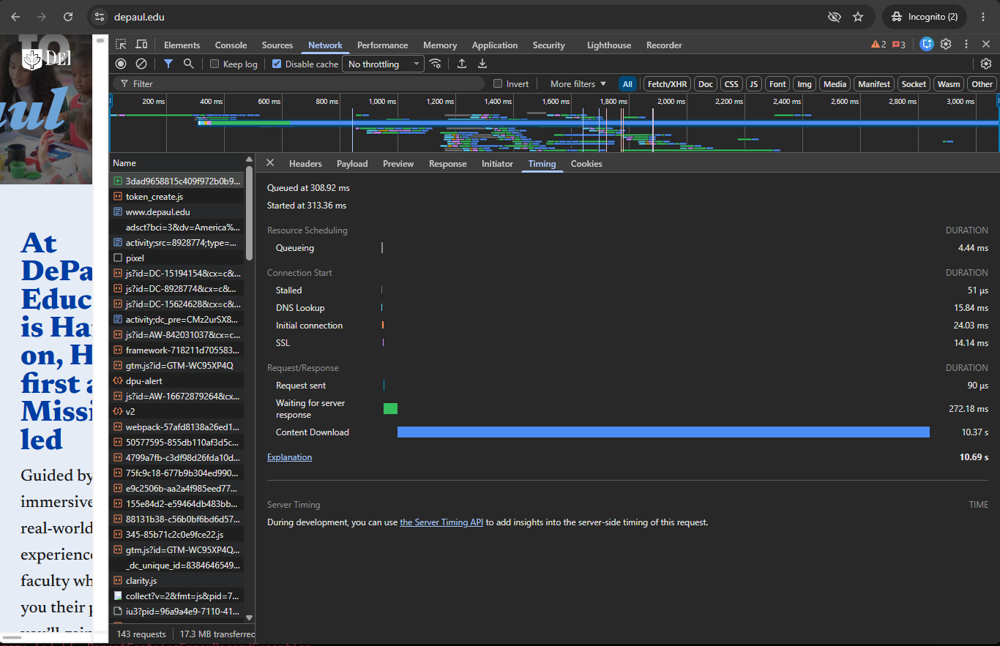

# CSC 436 - Homework 1 - task 6
# DevTools HAR and waterfall

Waterfall chart of Depaul University website. There were 143 requests made by the browser to load the page. The total number of bytes transfered was 17.3 MB. I counted 82 distinct hosts that were contacted to load the page.  The were five render blocking requests.  All the render blockers were stylesheets from fonts.googleapis.com.

The slowest request was from https://dpu-p-001.sitecorecontenthub.cloud/api/public/content/3dad9658815c409f972b0b9b37421bf1?v=fc3fab7d.
This script loads a video titled ""Hero Film - V7_Balanced - 01202026_1100.mp4". 
The request was started 313.36 ms after the page load started.  The request queued for 4.44 ms, then stalled for an additional 51 microseconds. The DNS looup took 24.03 ms to finish. The TCP handshake was an additional 24.03 ms. A TLS connection took 14.14 ms to establish.  It took just 90 microseconds to send the request and the browser waited 272.18 ms for the server to respond.  The content took 10.37 seconds to download.

The HAR

