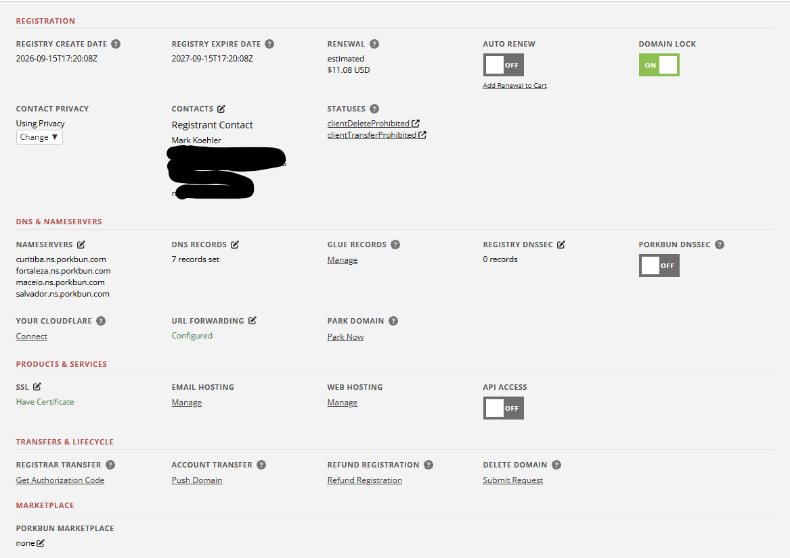
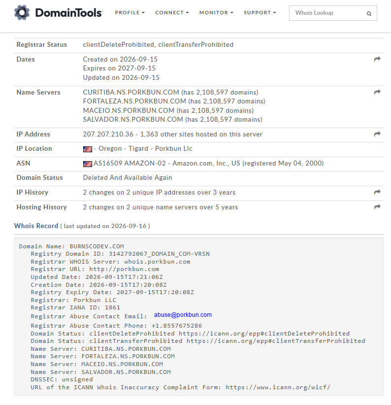

# CSC 436 - Homework 1 - Task 8
# Arrange a domain

Screenshot of Porkbun dashboard showing domain I purchased.

Screenshot of whois from DomainTools.com:  https://whois.domaintools.com/burnscodev.com

Proof I can change something.

PS C:\Users\mlkoe> nslookup -type=TXT burnscodev.com
Server:  setup.ui.com
Address:  192.168.80.1

Non-authoritative answer:
burnscodev.com  text =

        "CSC436-2026FALL-8D4F71A9C2B63E55"
burnscodev.com  text =

        "v=spf1 include:_spf.porkbun.com ~all"
